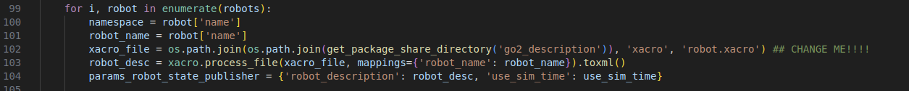
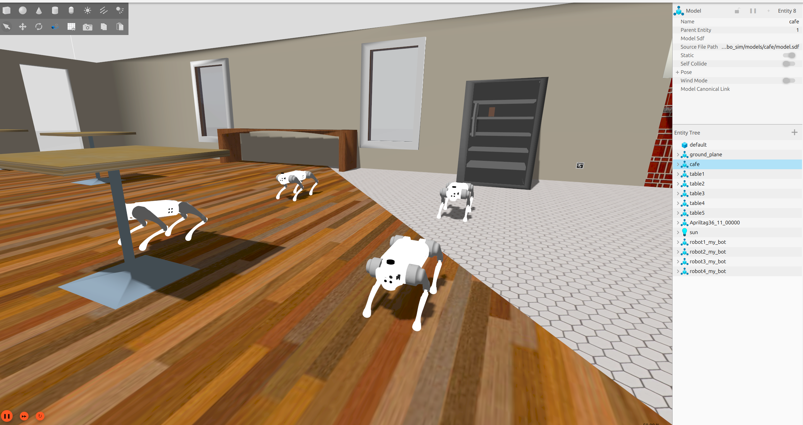
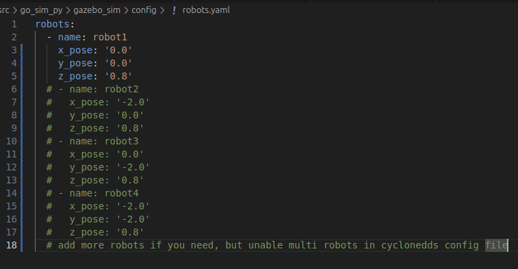

# Unitree go2, go1 simulation in Gazebo Sim

This repository allows you to run dog robots in the GAZEBO simulator. The robot can walk, rotate with 12 degrees of freedom, and features a `robot_msgs` interface. The robot moves using inverse kinematics, and its odometry is based on direct kinematics. Additionally, all functionalities are developed in Python.


## Run from docker 

> **Note:** BUILDED AND TESTED WITH NVIDIA GPU.

### setup docker, docker compose and nvidia container toolkit
[docker install](https://docs.docker.com/engine/install/ubuntu/)

[nvidia-container-toolkit](https://docs.nvidia.com/datacenter/cloud-native/container-toolkit/latest/install-guide.html)
### build docker :

```bash
mkdir -p ~/go_sim/src
cd ~/go_sim/src/docker
docker compose -f compose.yml build simulator
xhost +local:docker
docker compose -f compose.yml up simulator
```


## Run from source

> **Note:** BUILDED AND TESTED FROM ROS2 JAZZY, UBUNTU 22.04.

> **Note:** Before launching, ensure that you install all dependencies and build the project using `colcon build`.

---

## Setup and Installation

### Clone the Repository and Build

```bash
mkdir -p ~/go_sim/src
cd ~/go_sim/src
git clone https://github.com/abutalipovvv/go_sim_py.git .
cd ..
colcon build --symlink-install
```

### Install Dependencies

```bash
cd ~/go_sim
rosdep update
rosdep install --from-paths src --ignore-src -r -y
```

## Environment Configuration

### Export Gazebo Models Path

Before running the simulation, export the path to your Gazebo models:

```bash
export GZ_SIM_RESOURCE_PATH=~/go_sim/src/gazebo_sim/models
```
(Replace with the correct path to your models.)

### Configure CycloneDDS

To support multiple topics, configure CycloneDDS by creating a configuration file (e.g., cyclonedds.xml) with the following content:

```bash
<CycloneDDS>
  <Domain>
    <General>
      <Interfaces>
        <NetworkInterface name="lo" multicast="true" />
      </Interfaces>
      <DontRoute>true</DontRoute>
    </General>
    <Discovery>
      <ParticipantIndex>auto</ParticipantIndex>
      <MaxAutoParticipantIndex>100</MaxAutoParticipantIndex>
    </Discovery>
  </Domain>
</CycloneDDS>
```
Then, set the environment variable to point to this file:

```bash
export CYCLONEDDS_URI=file://path_to_cyclonedds.xml
```

(Replace `path_to_cyclonedds.xml` with the actual file path.)

## Running the Simulation

```bash
#Navigate to the project directory:

cd ~/go_sim

#Source the environment setup:

source install/local_setup.bash

#Launch the simulation:

ros2 launch gazebo_sim launch.py
```

## Controlling the Robot

### Moving the Robot

The robot moves by publishing velocity commands to the `<robot_namespace>/cmd_vel` topic. By default, the robot is named robot1.

Example using `teleop_twist_keyboard`:

```bash
source install/local_setup.bash
ros2 run teleop_twist_keyboard teleop_twist_keyboard --ros-args -r /cmd_vel:=/robot1/cmd_vel
```


Robot Modes

The robot supports several modes:

    REST – Default position in which the robot cannot move.
    STAND – Mode in which the robot can rotate in place.
    TROT – Walking mode.

The robot operates with 12 degrees of freedom. To enable rotation, switch the mode to "STAND" by publishing to the robot_mode topic.

Example (for a robot with namespace `robot1`):

```bash
ros2 topic pub /robot1/robot_mode quadropted_msgs/msg/RobotModeCommand "{mode: 'STAND', robot_id: 1}"
```

After switching modes, control the robot using velocity commands:

```bash
ros2 run teleop_twist_keyboard teleop_twist_keyboard --ros-args -r /cmd_vel:=/robot1/cmd_vel
```


### Changing Robot Behavior

The robot can sit and stand using the `robot_behavior_command` service.

Example command:

```bash
ros2 service call /robot1/robot_behavior_command quadropted_msgs/srv/RobotBehaviorCommand "{command: 'walk'}"
```

Possible commands:

    walk – The robot stands up (REST) and can walk (TROT).
    up – The robot stands up (REST) and locks movement.
    sit – The robot sits down (STAND).


## Multi-Robot Setup and Model Switching

### Changing Robot Models

You can change between robot models (e.g., go2, go1) in gazebo_multi_nav2_world.launch.py file 102 str:



for go2: use "go2_description" 
for go1: use "go1_description"

Running Multiple Robots Simultaneously


### The repository supports simultaneous operation of multiple robots. Each robot has access to nav2. In the robot.config file, add the robot’s namespace and spawn coordinates in the world.


### NAV2 work demonstration: 


## Credits, thaks for all

    mike4192: (SpotMicro)[https://github.com/mike4192/spotMicro]
    Unitree Robotics: (A1 ROS)[https://github.com/unitreerobotics/a1_ros]
    QUADRUPED ROBOTICS: (Quadruped)[https://quadruped.de]
    lnotspotl: (GitHub)[https://github.com/lnotspotl]
    anujjain-dev: (Unitree-go2 ROS2)[https://github.com/anujjain-dev/unitree-go2-ros2]

## TODO

    Add Gazebo Classic support (physics and inertial parameters for URDF).
    Perform odometry calibration 
